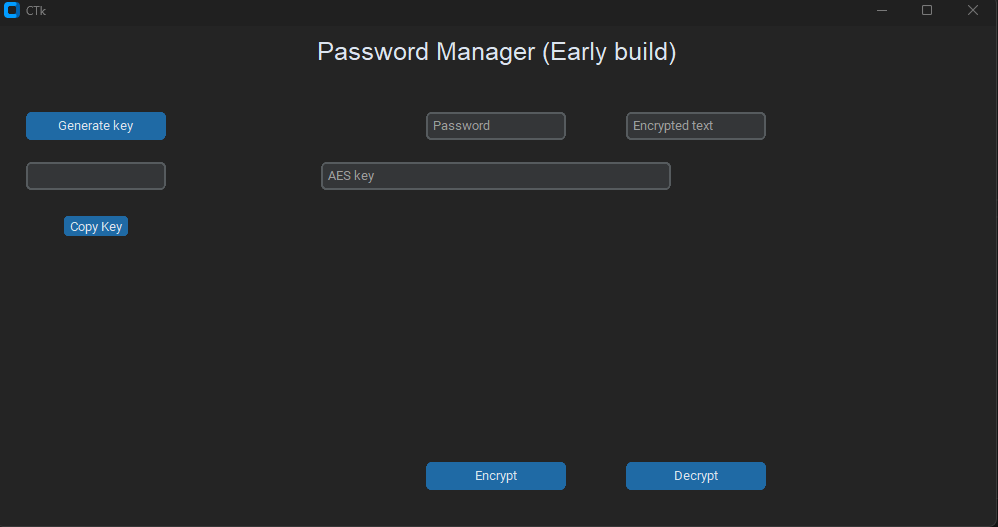

# Pyhton Password Manager
A password manager that encrypts your password and stores the encrypted version on your machine.

This simple application was made because I had lots of passwords for lots of different websites and accounts but didn't store them anywhere. 
Not wanting to store my passwords in plaintext I decided to create this simple application.

## What can this application do?
* **Encrypt using an AES key**
* **Decrypt using an AES key**
* **Generate a random AES key**
* **Store the encrypted text on your machine**
* Encrypt using hash (W.I.P)
* Store a website name and username alongside the password (W.I.P)

## Usage
Launching the .exe file will open a terminal and this window:

The ***Generate Key*** button will generate a random AES key to the field below the button.  
The ***Copy Key*** button will copy the generated password to the clipboard.

***Password*** field is used to input your password.  
***AES key*** field is used to input your generated password (doesn't get inserted automatically!)  
***Encrypted text*** field is used to input the encrypted text.

***Encrypt*** button takes the input from **Password** and **AES key** fields, encrypts the password, and saves the value to a "readme" file (file will be created in the same folder as the .exe file)  
***Decrypt*** button takes the input from **Encrypted text** and **AES key** fields, decrypts the password and outputs the decrypted password to the terminal.
